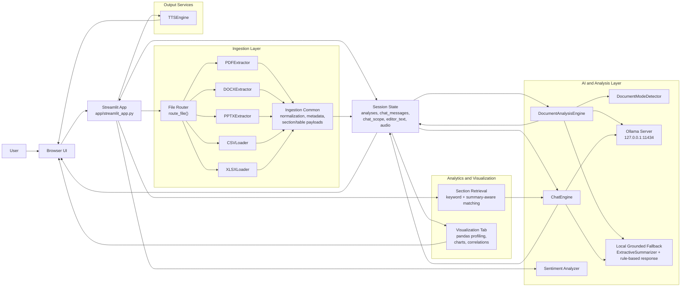
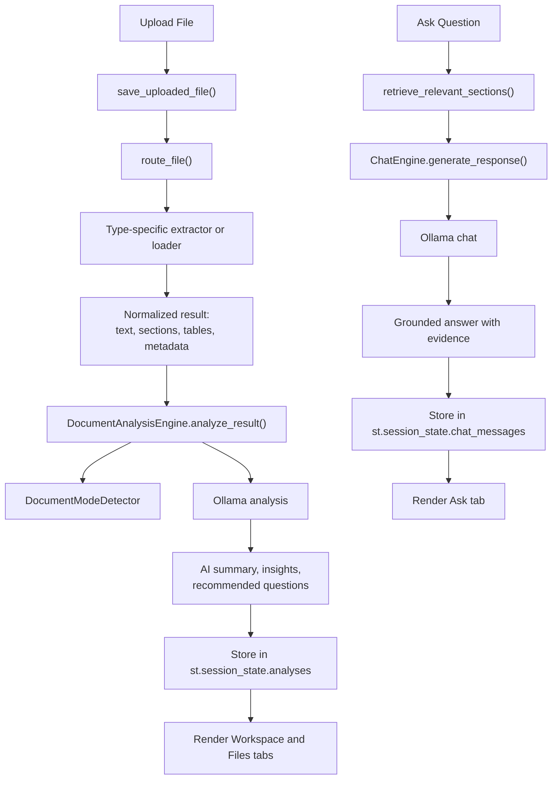

# CloudInsight System Architecture

This diagram reflects the current application structure in the codebase, including the redesigned Streamlit UI, ingestion layer, Ollama-backed analysis, local fallback logic, analytics, and audio output.

If your markdown viewer does not render Mermaid, open the raw diagram file at [docs/diagrams/system-architecture.mmd](/Users/pranesh/Devloper/Cloud%20Product/ClouDoc%20New/docs/diagrams/system-architecture.mmd). A plain-text fallback is also included below.

PNG export: [docs/diagrams/system-architecture.png](/Users/pranesh/Devloper/Cloud%20Product/ClouDoc%20New/docs/diagrams/system-architecture.png).

## Plain-Text View

```text
User
  -> Browser UI
  -> Streamlit App (app/streamlit_app.py)
       -> Session State
       -> File Router
            -> PDFExtractor
            -> DOCXExtractor
            -> PPTXExtractor
            -> CSVLoader
            -> XLSXLoader
            -> Ingestion Common
                 -> normalized text / sections / tables / metadata
                 -> stored in session state
       -> DocumentAnalysisEngine
            -> DocumentModeDetector
            -> Ollama
            -> local fallback
       -> ChatEngine
            -> section retrieval
            -> Ollama
            -> local fallback
       -> Visualization flow
            -> pandas summaries
            -> charts / correlations
       -> TTSEngine
            -> audio playback in browser
```

## High-Level Architecture



## Primary Request Flows



## Component Notes

- `app/streamlit_app.py`
  - Main orchestration layer for the UI, session state, file routing, chat, analysis display, charts, and TTS playback.
- `services/ingestion/*`
  - Extracts content from PDFs, DOCX, PPTX, CSV, and XLSX into a common payload format.
- `services/ingestion/common.py`
  - Shared normalization and metadata helpers used by ingestion services.
- `services/llm/chat_engine.py`
  - Grounded Q&A engine using Ollama first, with a local fallback when Ollama is unavailable.
- `services/llm/document_analysis_engine.py`
  - File-level AI analysis engine that generates summaries, insights, and follow-up questions.
- `services/document_mode_detector.py`
  - Classifies the uploaded document into modes like resume, invoice, research paper, or general document.
- `services/nlp/summarizer.py`
  - Lightweight local summarization used in fallback flows.
- `services/audio/tts_engine.py`
  - Converts generated answers or draft text into downloadable audio.

## Current Deployment Model

- Frontend and backend are combined in a single Streamlit process.
- Local LLM inference is delegated to Ollama over HTTP.
- Application state is session-based rather than persisted in a database-backed workspace model.
- Analytics currently operate on ingested in-memory datasets and preview tables.

## Likely Next-Step Architecture Upgrades

- Persistent workspace storage for files, analyses, and chats
- Vector retrieval using `services/rag/*` for semantic search instead of lexical-only matching
- Background job processing for large file ingestion and analysis
- OCR pipeline for scanned PDFs and image-heavy documents
- Collaboration and sharing layer for saved reports and team workflows
